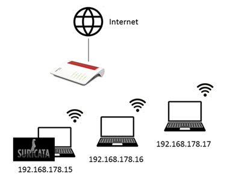

# Sicherheitsmaßnahmen in einer Cyber Kill Chain
***Access Control:*** Die Zugriffskontrolle umfasst die Zugriffsverwaltung und 
-steuerung auf bestimmte Objekte. Die Zugriffsrechte der Benutzer sollten auf ein Minimum reduziert werden (Prinzip der geringsten Privilegien). 

***Access Control List:*** In der Zugriffskontrollliste werden die Zugriffsberechtigungen auf Objekte geführt. [12, S. 815]  
[12] K.-R. Müller, IT-Sicherheit mit System: Integratives IT-Sicherheits-, Kontinuitäts- und Risikomanagement – Sichere Anwendungen – Standards und Practices, 6. Aufl. Wiesbaden: Springer Vieweg, 2018.

***Application Allowlisting** (Whitelisting):* Diese Sicherheitskontrolle erlaubt die Ausführung ausschließlich vorgeprüfter Applikationen und Prozesse sowie den Zugriff auf zugelassene Dateien durch solche Applikationen. Darüber hinaus wird nur der Zugriff von Nutzern und Devices gestattet, die ebenfalls in der Allowlist aufgeführt sind. Entitäten, die nicht auf der Allowlist stehen, haben generell keinen Zugriff. [13]  
[13] A. Krishnan, „Allowlisting vs. blocklisting: Benefits and challenges“, TechTarget, 10. Jan. 2022, 2022. [Online]. Verfügbar unter: https://www.techtarget.com/searchsecurity/tip/Allowlisting-vs-blocklisting-Benefits-and-challenges. Zugriff am: 6. Juni 2022.

***Audit Log:*** Ein Audit Log ist eine Sammlung von Daten über Nutzeraktivitäten, die eine Zurückverfolgung und bei der Aufklärung eventueller Widersprüche helfen kann. [14, S. 549]  
[14] Y. Ohtaki und K. Togashi, „A Practical Implementation of Searchable Encrypted Audit Logging System“ in Advances in Intelligent Systems and Computing Ser, v.1264, Advances in Networked-Based Information Systems: The 23rd International Conference on Network-Based Information Systems (NBiS-2020), L. Barolli, Hg., Cham: Springer International Publishing AG, 2021, S. 549–559, doi: 10.1007/978-3-030-57811-4_55.

***DNS Redirect:*** Bei der *DNS-Redirection* wird eine andere Webseite ausgeliefert als angefordert wurde. [15]  
[15] WhatIs.com, What is DNS redirection? - Definition from WhatIs.com. [Online]. Verfügbar unter: https://www.techtarget.com/whatis/definition/DNS-redirection (Zugriff am: 6. Juni 2022).

***Hardening:*** Das *Härten* beschreibt einen Prozess, mit dem die Sicherheit eines Systems erhöht werden soll, indem Schwachstellen beseitigt und nicht erforderliche Services abgeschaltet werden. [16]  
[16] Computer Security Resource Center, Glossary: Hardening. [Online]. Verfügbar unter: https://csrc.nist.gov/glossary/term/hardening (Zugriff am: 18. Juni 2022).

***Honeypot:*** *Honigtöpfe* sind Attrappen von Systemen, die potenzielle Angreifer anlocken sollen, um deren Methoden und Techniken kennenzulernen, zu analysieren und Abwehrmaßnahmen zu entwickeln. [12, S. 525 f.]

***IDS, IPS:*** Da ein Intrusion Detection und Intrusion Prevention System in vielen Stufen der Cyber Kill Chain eingesetzt und als Proof of Concept im Rahmen dieser Arbeit implementiert wird, werden IDPSe im Abschnitt 3.4.3 Intrusion Detection und Prevention Systeme ausführlicher beschrieben.

***Network Segmentation:*** Bei der Netzwerksegmentierung wird zwecks Risikominimierung das Netzwerk derart aufgeteilt, dass kritische Netzwerksegmente von den unkritischen getrennt werden. Der Netzwerkverkehr wird an den Übergangspunkten zwischen den Netzwerksegmenten kontrolliert. [17, S. 145]  
[17] M. Wurm, Automotive Cybersecurity: Security-Bausteine für Automotive Embedded Systeme, 1. Aufl. Berlin, Heidelberg: Springer Berlin Heidelberg; Imprint Springer Vieweg, 2022.

***Quality of Service (QoS):*** Quality of Service umfasst Anforderungen an die Netzwerkperformanz hinsichtlich zulässiger Verzögerungen, Paketverlustraten und verfügbarer Übertragungsraten. [18, S. 253]  
[18] P.-B. Bök, A. Noack, M. Müller und D. Behnke, „Quality of Service“ in Lehrbuch, Computernetze und Internet of Things: Technische Grundlagen und Spezialwissen, P.-B. Bök, A. Noack, M. Müller und D. Behnke, Hg., Wiesbaden, Heidelberg: Springer Vieweg, 2020, S. 251–291, doi: 10.1007/978-3-658-29409-0_14.

***Security Information and Event Management (SIEM):*** SIEM-Systeme überwachen das IT-Netzwerk, sammeln Daten, analysieren diese und werten Ereignisse aus, um Sicherheitsprobleme zu erkennen. Logdateien werden verwaltet, Warnungen gesendet und Berichte erstellt. SIEM-Systeme werden eingesetzt, um Angriffe schneller identifizieren und eindämmen zu können. [19, S. 1509] [20, S. 33] [21]  
[19] A. Majeed, R. ur Rasool, F. Ahmad, M. Alam und N. Javaid, „Near-miss situation based visual analysis of SIEM rules for real time network security monitoring“, J Ambient Intell Human Comput, Jg. 10, Nr. 4, S. 1509–1526, 2019, doi: 10.1007/s12652-018-0936-7.  
[20] G.-S. Jeon, S.-H. Chun und J.-B. Kim, „A Study on the Methods for Establishing Security Information & Event Management“ in Studies in Computational Intelligence Ser, v.847, Applied Computing and Information Technology, R. Lee, Hg., Cham: Springer International Publishing AG, 2020, S. 33–45, doi: 10.1007/978-3-030-25217-5_3.  
[21] Rapid7, Was ist SIEM und wie funktioniert es? Ein Überblick | Rapid7. [Online]. Verfügbar unter: https://www.rapid7.com/de/cybersecurity-grundlagen/siem/ (Zugriff am: 5. Juni 2022).

***Tarpit:*** Mit *Teerfallen* können nicht erwünschte Verbindungen künstlich verlangsamt werden. Sie werden insbesondere gegen Würmer, Portscans und zur Spambekämpfung eingesetzt. [12, S. 526 f.]

***Threat Intelligence:*** Die Aufgabe von Threat Intelligence besteht darin, Unternehmen oder Organisationen über die aktuelle Bedrohungslage aufzuklären und ihnen eine Entscheidungshilfe zu bieten, damit sie nach Möglichkeit einen strategischen Vorteil haben. Zu diesem Zweck werden Informationen zu spezifischen Bedrohungen und potenziellen Angriffsquellen gesammelt, analysiert und bereitgestellt. [22] [23, S. 233]  
[22] ComputerWeekly.de, Was ist Threat Intelligence? - Definition von WhatIs.com. [Online]. Verfügbar unter: https://www.computerweekly.com/de/definition/Threat-Intelligence (Zugriff am: 5. Juni 2022).  
[23] G. K. Singh und B. Arora, „Cyber Threat Intelligence “Comparative Analysis of Its Sources and Parameters of Evaluation”“ in Springer eBook Collection, Bd. 385, Innovations in Computer Science and Engineering: Proceedings of the Ninth ICICSE, 2021, H. S. Saini, R. Sayal, A. Govardhan und R. Buyya, Hg., 1 Aufl., Singapore: Springer Singapore; Imprint Springer, 2022, S. 233–243, doi: 10.1007/978-981-16-8987-1_25.

***Trusted Computing (TC):*** Diese Technologie dient der Vertrauenswürdigkeit und Robustheit eines IT-Systems und umfasst Sicherheitskonzepte und -architekturen.

***Two-factor Authentication (2FA):*** Für die Zwei-Faktor-Authentifizierung ist eine Kombination aus zwei Faktoren für die Authentifizierung erforderlich, z.B. Login-Credentials und einem PIN oder einem zeitlich begrenzten Code und einem biometrischen Faktor. [24, S. 104]  
[24] N. Dutta, N. Jadav, S. Tanwar, H. K. D. Sarma und E. Pricop, Cyber Security: Issues and Current Trends, 1. Aufl. Singapore: Springer Singapore; Imprint Springer, 2022.

***Vigilant User:*** Nutzer können mit Hilfe von Awareness-Trainings wachsamer werden und damit zu Vigilant Usern (aufmerksame Benutzer) werden.

***Web Analytics:*** Die Webanalyse umfasst die Sammlung und Auswertung von Daten, um Rückschlüsse auf das Nutzerverhalten auf Webseiten ziehen zu können. [25]  
[25] SearchBusinessAnalytics, What is web analytics? [Online]. Verfügbar unter: https://www.techtarget.com/searchbusinessanalytics/definition/Web-analytics (Zugriff am: 5. Juni 2022).

# Auswahl eines Intrusion Detection und Prevention Systems
IDS-/IPS-Lösung identifizieren potenzielle Bedrohungen auf der Grundlage  
integrierter Regeln und Profile. Diese Regeln beruhen im Allgemeinen  
auf Signaturen oder Anomalien. Doch welche IDS-/IPS-Lösung ist für welchen  
Einsatzzweck geeignet? Welche Voraussetzungen benötigen diese Systeme  
hinsichtlich Hardware und fachlicher Expertise bei der Konfiguration?  
Welche Budgets müssen berücksichtigt werden? Als erstes Vorauswahlkriterium  
haben wir uns auf Open Source IDS-/IPS Systeme beschränkt. Aufgrund der knappen  
Zeit und des Null Budget war diese Einschränkung am naheliegendsten.  
Wir haben folgende Open Source IDS-/IPS-Systeme näher recherchiert.  

### Snort
Snort ist eines der ältesten IDS Systeme und quasi ein Standard-IDS  
in der Open-Source-Welt. Snort verfügt nicht über eine grafische  
Benutzeroberfläche, bietet aber dennoch ein hohes Maß an Anpassungsmöglichkeiten.  
Es kann zur Erkennung einer Vielzahl von Angriffen wie Buffer-Overflow,  
Stealth-Port-Scans, CGI-Angriffen, OS-Fingerprinting-Versuchen und vielem  
mehr verwendet werden. Die Snort-Community lebt von engagierten Entwicklern,  
die Support für die Software leisten. Snort ist für Linux, Windows, Fedora,  
Centos und FreeBSD verfügbar.[30]  
[30]	Snort Setup Guides for Emerging Threats Prevention. [Online].  
Verfügbar unter: https://www.snort.org/documents (Zugriff am: 3. Juni 2022).  

### Zeek
Zeek ist ein leistungsfähiges Netzwerküberwachungsprogramm, das sich auf die  
allgemeine Netzwerkanalyse konzentriert. Es verwendet eine domänenspezifische  
Sprache, die sich nicht auf traditionelle Signaturen stützt. Zeek kann z.B.  
so konfiguriert werden, dass es verdächtige Dateien automatisch herunterlädt,  
diese analysiert, die Ergebnisse weiterschickt und die Quelle auf eine schwarze  
Liste setzt und das Gerät, das die Datei heruntergeladen hat, abschaltet.  
Zeek läuft auf Unix, Linux, Free BSD und Mac OS X und kann verdächtige Signaturen  
und Anomalien erkennen. Die Benutzergemeinschaft von Zeek wird von einigen  
bekannten Universitäten, Supercomputing-Zentren, Forschungslabors und auch  
vielen Open-Science-Communities unterstützt.[31]  
[31] Zeek Documentation — Book of Zeek (git/master). [Online].  
Verfügbar unter: https://docs.zeek.org/en/master/ (Zugriff am: 3. Juni 2022).  

### OSSEC
OSSEC ist ein IDS-System, das Protokollanalyse, Dateiintegritätsüberwachung,  
Windows-Registrierungsüberwachung, zentralisierte Richtliniendurchsetzung,  
Rootkit-Erkennung, Echtzeit-Alarmierung und aktive Reaktion bietet. OSSEC läuft  
auf den Betriebssystemen Linux, OpenBSD, FreeBSD, MacOS, Solaris und Windows.  
OSSEC verfügt über eine Client/Server-Architektur, die Warnmeldungen und  
Protokolle zur Analyse an einen zentralen Server sendet, selbst wenn das  
Host-System  vollständig kompromittiert ist. [32]  
[32]	OSSEC Documentation — OSSEC. [Online].  
Verfügbar unter: https://www.ossec.net/docs/ (Zugriff am: 3. Juni 2022).  

### Suricata  
Suricata ist eine robuste Engine zur Erkennung von Netzwerkbedrohungen,  
die Intrusion Detection in Echtzeit, Inline Intrusion Prevention (IPS),  
Network Security Monitoring (NSM) und Offline-Pcap-Verarbeitung ermöglicht.  
Obwohl sich die Architektur von Suricata von Snort unterscheidet, verhält es  
sich wie Snort und kann die gleichen Signaturen verwenden. Während Snort als  
Single-Thread-System arbeitet, d. h. es kann nur eine CPU gleichzeitig nutzen,  
ist Suricata ein Multi-Thread-System, das alle verfügbaren CPUs nutzen kann.  
Suricata verfügt außerdem über eine integrierte Hardware-Beschleunigungstechnologie,  
welche die Leistung von Grafikkarten für die Untersuchung des Netzwerkverkehrs  
nutzen kann. Suricata ist in der Lage, Lua-Skripte aufzurufen, die dazu verwendet  
werden können, den Datenverkehr zu untersuchen oder Malware zu entschlüsseln.  
Suricata ist für Linux, FreeBSD, OpenBSD, macOS / Mac OS X und Windows verfügbar  
und wird von einer treuen Community unterstützt. [33]  
[33]	Suricata, Documentation - Suricata. [Online].  
Verfügbar unter: https://suricata.io/documentation/ (Zugriff am: 3. Juni 2022).  

### Security Onion
Security Onion wurde für die Suche nach Bedrohungen, die Erkennung von Eindringlingen,  
die Überwachung der Unternehmenssicherheit und die Protokollverwaltung entwickelt.  
Das Interessante an diesem Tool ist, dass es die Leistung anderer Sicherheitstools  
wie Snort, Kibana, Zeek, Wazuh, CyberChef, NetworkMiner, Suricata und Logstash kombiniert.  
Diese Funktion macht es sehr umfassend und vielseitig und deckt so ziemlich jeden Winkel  
der IT-Sicherheit ab. Das Einrichten und Arbeiten mit mehreren Tools kann kompliziert sein,  
aber Security Onion verfügt über einen intuitiven Einrichtungsassistenten, der den  
Einrichtungsprozess vereinfacht. Einer der Nachteile dieses Tools ist,  
dass einige der Tools sich überschneidende Funktionen haben und die Navigation  
zwischen den Tools kompliziert sein kann. [34]  
[34]	Security Onion Documentation — Security Onion 2.3 documentation. [Online].  
Verfügbar unter: https://docs.securityonion.net/en/2.3/ (Zugriff am: 3. Juni 2022).  

### Festlegung auf IDS-/IPS für PoC
Nach Abschluss der Recherche haben wir uns anhand der Kriterien:  
  
    • Open Source  
    • Unterstützung möglichst vieler Betriebssysteme  
    • eine aktuelle sehr gut gepflegte Dokumentation  
    • eine performant und ressourcenschonend arbeitende Regel-Engine  
      
      
für Suricata als IDS-/IPS System für den PoC entschieden.  
  
  
# Aufbau der Testumbegung
Suricata hat, je nach Anwendungsfall und Einsatzzweck unterschiedlichste  
Anforderungen bezüglich der Rechenleistung, des Arbeitsspeichers und des  
Speicherplatzes. Da wir in unserem PoC kein Live-Monitoring aller Datenpakete  
inklusive Speicherung vorsehen, greifen wir auf Entwicklerlaptops zurück, die  
mit 32 GB Arbeitsspeicher und einem Core i7 Prozessor ausgestattet sind.  
  
 
  
  
Letztendlich haben wir unsere finale PoC Installation auf einem ubuntu 22.04 LTS  
server durchgeführt. Nach dem Aufsetzten des 22.04 ubuntu servers unter  
Virtual Box erfolgte die Einbindung der Personal Package Archives (PPAs):  
  
## Installation von Suricata  

```sudo add-apt-repository ppa:oisf/suricata-stable –yes```

Aktualisierung des repositories mit: 

```sudo apt update```

Installation von suricata mit dem Paketmanager 

```apt-cache policy suricata```  
```sudo apt install suricata jq```  
  
Test der erfolgreichen Installation über die Ausgabe der Versionsnummer. 

```sudo suricata --build-info```

## Konfiguration von Suricata

Die Konfigurationsdatei von Suricata liegt unter: 

```/etc/suricata/suricata.yaml```

Über die Konfigurationsdatei wird der Speicherort der Regeln  
und des Loggings festgelegt.  
  
  
 
Für die initiale Konfiguration ist der Quickstart guide sehr empfehlenswert.  
(Quelle: <https://suricata.readthedocs.io/en/latest/quickstart.html>)  
  
Für unseren PoC haben wir das default Verzeichnis für die Suricata Regeln  
unverändert gelassen. Mit Abschluss der Installation sind  
unter ```/etc/suricata/rules``` folgende Regeldateien abgelegt:  
  
  
  
Nach Abschluss der Konfiguration kann diese mit folgendem Befehl syntaktisch überprüft werden:

```sudo suricata -T -c /etc/suricata/suricata.yaml –v```

Wenn die Konfigurationsprüfung ohne Fehlermeldung zurückkehrt,  
kann suricata mit folgendem Befehl gestartet werden: 

```sudo systemctl enable --now suricata```

Der aktuelle Status lässt sich anschließend mit:  

```sudo systemctl status suricata``` ermitteln.  

  

## Test-Case: SYN-flood 

Als Test-Case soll ein SYN-flood mit Hping3 erzeugt werden, welche idealerweise  
von suricata erkannt wird. Zur Vorbereitung des Tests wird die Packet-Offload-Funktionen
der Netzwerkschnittstelle, auf der Suricata lauscht mit: 

```ethtool -K enp0s3 gro off lro off``` deaktiviert  

  
Suricata wird jetzt im PCAP Modus gestartet und monitort den Netzwerkcerkehr der Schnittstelle: enp0s3  
Die SYN-flood Attacke wird von den Systemen ```192.168.178.16``` bzw. ```192.168.178.17``` gestartet mit: 

```hping3 -S -p 80 --flood --rand-source 192.168.178.15 -I enp0s3 -c 150```
  
Suricata schreibt alle Ausgaben der DDoS-Attacke in das Logfile: ```/var/log/suricata/fast.log```
  
Im Logfile finden sich die folgenden Warnungen:  
```
[Classification: Misc Attack] [Priority: 2] {TCP} 192.168.178.16:17846 -> 192.168.178.15:80
05/28/2022 … ET DROP Spamhaus DROP Listed Traffic Inbound group 16 ...  
[Classification: Misc Attack] [Priority: 2] {TCP} 192.168.178.17:17899 -> 192.168.178.15:80  
05/28/2022 … ET DROP Spamhaus DROP Listed Traffic Inbound group 2 ... 

```

## Test-Case: SQL-Injection
  
Die Anfälligkeit einer Web-Anwendung gegenüber SQL-Injection kann z.B. über das Skript:  
(Quelle: <https://nmap.org/nsedoc/scripts/http-sql-injection.html>) ermittelt werden.  
Das Skript durchsucht einen HTTP-Server nach URLs, die Abfragen enthalten.  
Anschließend kombiniert das Skript manipulierte SQL-Befehle mit anfälligen URLs,  
um einen Fehler zu erhalten. Die Fehler werden analysiert, um festzustellen,  
ob die URL anfällig für Angriffe ist. Das Skript stellt die einfachste Form der SQL-Injektion dar.  

Über die in Suricata hinterlegt Regel:  
```
alert http $EXTERNAL_NET any -> $HTTP_SERVERS any (msg:"ET SCAN NMAP SQL Spider Scan";  
flow:established,to_server; http.method; content:"GET"; http.uri; content:" OR sqlspider";  
reference:url,nmap.org/nsedoc/scripts/sql-injection.html; classtype:web-application-attack;  
sid:2013778; rev:3; metadata:created_at 2011_10_19, updated_at 2020_04_20;)
```  

Der SQL-Injection-Test wird von den Systemen ```192.168.178.16``` bzw. ```192.168.178.17``` mit: ```nmap -sV --script=http-sql-injection 192.168.178.15``` gestartet.


