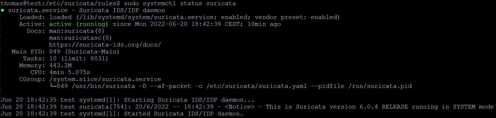

# Aufbau der Testumbegung
Suricata hat, je nach Anwendungsfall und Einsatzzweck unterschiedlichste  
Anforderungen bezüglich der Rechenleistung, des Arbeitsspeichers und des  
Speicherplatzes. Da wir in unserem PoC kein Live-Monitoring aller Datenpakete  
inklusive Speicherung vorsehen, greifen wir auf Entwicklerlaptops zurück, die  
mit 32 GB Arbeitsspeicher und einem Core i7 Prozessor ausgestattet sind.  
  
 
  
  
Letztendlich haben wir unsere finale PoC Installation auf einem ubuntu 22.04 LTS  
server durchgeführt. Nach dem Aufsetzten des 22.04 ubuntu servers unter  
Virtual Box erfolgte die Einbindung der Personal Package Archives (PPAs):  
  
## Installation von Suricata  

```sudo add-apt-repository ppa:oisf/suricata-stable –yes```

Aktualisierung des repositories mit: 

```sudo apt update```

Installation von suricata mit dem Paketmanager 

```apt-cache policy suricata```  
```sudo apt install suricata jq```  
  
Test der erfolgreichen Installation über die Ausgabe der Versionsnummer. 

```sudo suricata --build-info```

## Konfiguration von Suricata

Die Konfigurationsdatei von Suricata liegt unter: 

```/etc/suricata/suricata.yaml```

Über die Konfigurationsdatei wird der Speicherort der Regeln  
und des Loggings festgelegt.  
  
  
 
Für die initiale Konfiguration ist der Quickstart guide sehr empfehlenswert.  
(Quelle: <https://suricata.readthedocs.io/en/latest/quickstart.html>)  
  
Für unseren PoC haben wir das default Verzeichnis für die Suricata Regeln  
unverändert gelassen. Mit Abschluss der Installation sind  
unter ```/etc/suricata/rules``` folgende Regeldateien abgelegt:  
  
  
  
Nach Abschluss der Konfiguration kann diese mit folgendem Befehl syntaktisch überprüft werden:

```sudo suricata -T -c /etc/suricata/suricata.yaml –v```

Wenn die Konfigurationsprüfung ohne Fehlermeldung zurückkehrt,  
kann suricata mit folgendem Befehl gestartet werden: 

```sudo systemctl enable --now suricata```

Der aktuelle Status lässt sich anschließend mit:  

```sudo systemctl status suricata``` ermitteln.  

  

## Test-Case SYN-flood 

Als Test-Case soll ein SYN-flood mit Hping3 erzeugt werden, welche idealerweise  
von suricata erkannt wird. Zur Vorbereitung des Tests wird die Packet-Offload-Funktionen
der Netzwerkschnittstelle, auf der Suricata lauscht mit: 

```ethtool -K enp0s3 gro off lro off``` deaktiviert  

  
Suricata wird jetzt im PCAP Modus gestartet und monitort den Netzwerkcerkehr der Schnittstelle: enp0s3  
Die SYN-flood Attacke wird gestartet mit: 

```hping3 -S -p 80 --flood --rand-source 192.178.162.15 -I enp0s3 -c 150```
  
Suricata schreibt alle Ausgaben der DDoS-Attacke in das Logfile: ```/var/log/suricata/fast.log```
  
Im Logfile finden sich die folgenden Warnungen:  
```
05/28/2022 … ET DROP Spamhaus DROP Listed Traffic Inbound group 26 ...  
[Classification: Misc Attack] [Priority: 2] {TCP} 192.178.162.16:17846 -> 192.178.162.15:80
05/28/2022 … ET DROP Spamhaus DROP Listed Traffic Inbound group 16 ...  
[Classification: Misc Attack] [Priority: 2] {TCP} 192.178.162.17:17899 -> 192.178.162.15:80  
05/28/2022 … ET DROP Spamhaus DROP Listed Traffic Inbound group 2 ... 
[Classification: Misc Attack] [Priority: 2] {TCP} 192.178.162.18:20024 -> 192.178.162.15:80
```

## Test-Case SQL-Injection
  
Die Anfälligkeit einer Web-Anwendung gegenüber SQL-Injection kann z.B. über das Skript:  
(Quelle: <https://nmap.org/nsedoc/scripts/http-sql-injection.html>) ermittelt werden.  
Das Skript durchsucht einen HTTP-Server nach URLs, die Abfragen enthalten.  
Anschließend kombiniert das Skript manipulierte SQL-Befehle mit anfälligen URLs,  
um einen Fehler zu erhalten. Die Fehler werden analysiert, um festzustellen,  
ob die URL anfällig für Angriffe ist. Das Skript stellt die einfachste Form der SQL-Injektion dar.  

Über die in Suricata hinterlegt Regel:  
```
alert http $EXTERNAL_NET any -> $HTTP_SERVERS any (msg:"ET SCAN NMAP SQL Spider Scan"; flow:established,to_server; http.method; content:"GET"; http.uri; content:" OR sqlspider"; reference:url,nmap.org/nsedoc/scripts/sql-injection.html; classtype:web-application-attack; sid:2013778; rev:3; metadata:created_at 2011_10_19, updated_at 2020_04_20;)
```


